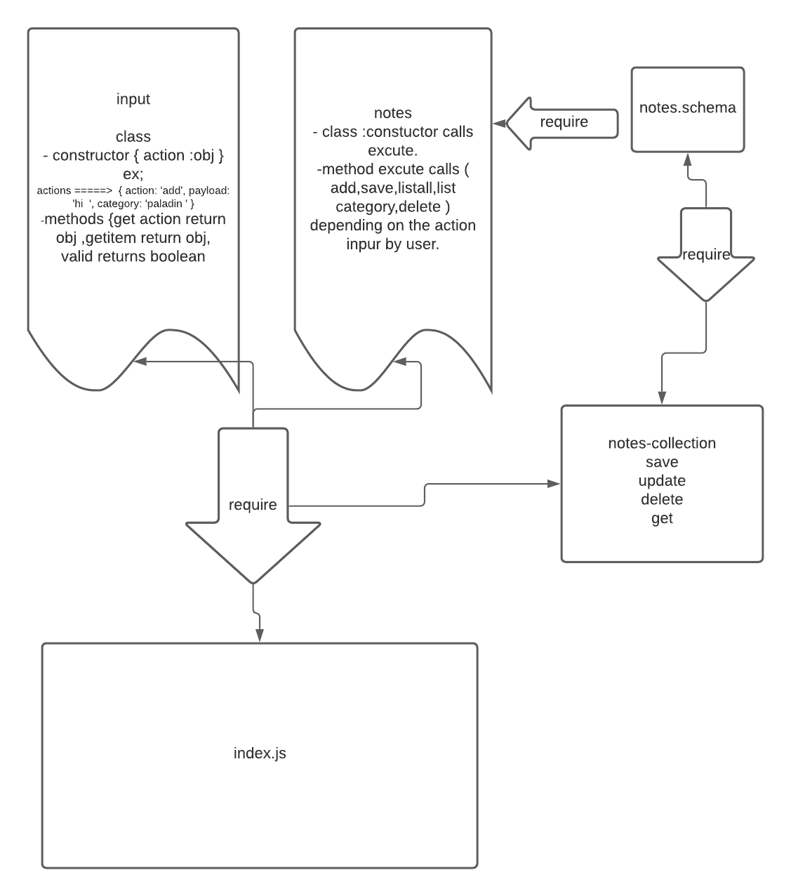

# Notesy
Author: Waleed farraj

[Test reports](https://github.com/waleed-401-advanced-javascript/data-structures-and-algorithms/actions)

### Setup
.env requirements
Database - Port Number
.packages and indpendices 
npm init -y 
npm i dotenv
npm i @code-fellows/supergoose
npm i express 
npm i minimist
npm i mongose 
npm i --save dev jest

### Running the app
 - node index.js  -a -add to add notes and save them to the data base .
 - node index.js --list "category "  to view all notes who share this category and --list with no string to view all 
 - node index.js --delete 5f5caee1b5420c5f3a0dae4b for example i used this id you will use the id of the note you want to delete .

### Tests
Unit Tests: npm  test

### UML

